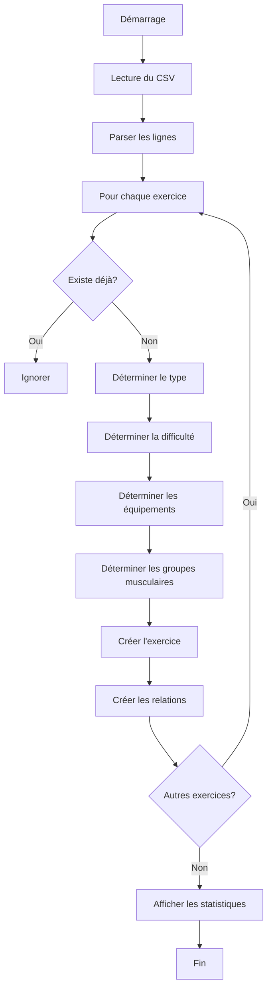

# 🎯 Guide Complet - Import des Exercices CSV

> Import automatique de 890 exercices avec détection intelligente du type, difficulté et équipements

## 📋 Vue d'Ensemble

Ce guide vous explique comment utiliser le système d'import CSV pour ajouter 890 exercices complets à votre base de données Myo-Fitness.

### ✨ Points Clés

- ✅ **890 exercices** prêts à l'emploi
- ✅ **Détection automatique** du type et de la difficulté
- ✅ **Mapping intelligent** vers les groupes musculaires
- ✅ **Prévention des doublons**
- ✅ **Exécution en 10-15 secondes**

## 🚀 Installation en 3 Étapes

### Étape 1 : Préparer la base de données

```bash
cd api

# Générer le client Prisma
npm run prisma:generate

# Appliquer les migrations
npm run prisma:migrate

# Créer les données de base (groupes musculaires, équipements, etc.)
npm run prisma:seed
```

### Étape 2 : Importer les exercices

```bash
npm run prisma:seed:exercices
```

### Étape 3 : Vérifier l'import

Vous devriez voir :

```
🌱 Début du seeding des exercices depuis le CSV...
📖 Lecture du fichier CSV...
✅ 891 exercices trouvés dans le CSV

💪 Création des exercices...
  ✅ 50 exercices créés...
  ✅ 100 exercices créés...
  ...
  ✅ 890 exercices créés...

🎉 Seeding des exercices terminé !
📊 Résumé:
  - ✅ 890 exercices créés
  - ⏭️  0 exercices ignorés
  - ❌ 0 erreurs

📈 Statistiques de la base de données:
  - Total d'exercices: 960
  - Exercices au poids du corps: 125
  - Exercices avec matériel: 835

📊 Répartition par difficulté:
  - Niveau 1: 89 exercices
  - Niveau 2: 245 exercices
  - Niveau 3: 398 exercices
  - Niveau 4: 156 exercices
  - Niveau 5: 72 exercices

📊 Répartition par type:
  - COMPOUND: 524 exercices
  - ISOLATION: 356 exercices
  - CARDIO: 45 exercices
  - MOBILITY: 23 exercices
  - STRETCH: 12 exercices
```

## 📊 Structure du CSV

Le fichier `fitness_final.csv` contient :

| Colonne | Type | Description | Exemple |
|---------|------|-------------|---------|
| `categorie` | string | Catégorie de l'exercice | "Exercices epaules" |
| `nom_exercice` | string | Nom de l'exercice | "Développé militaire" |
| `description` | string | Description complète | "Le développé militaire..." |
| `gif_url` | string | URL du GIF (non utilisé actuellement) | "https://..." |

## 🧠 Intelligence Artificielle du Script

### Détection du Type

Le script analyse le nom de l'exercice et détermine automatiquement son type :

```typescript
"Développé couché"        → COMPOUND
"Curl biceps"             → ISOLATION
"Burpees"                 → CARDIO
"Étirement des épaules"   → STRETCH
"Mobilité de la hanche"   → MOBILITY
```

### Détection de la Difficulté

```typescript
"Pompes assistées"        → Niveau 1 (Facile)
"Pompes classiques"       → Niveau 2 (Facile-Moyen)
"Pompes diamant"          → Niveau 3 (Moyen)
"Pompes sautées"          → Niveau 4 (Difficile)
"Handstand push-up"       → Niveau 5 (Très difficile)
```

### Mapping des Groupes Musculaires

| Catégorie CSV | Groupes Musculaires Assignés |
|---------------|------------------------------|
| Exercices epaules | Épaules + Trapèzes |
| Exercices biceps | Biceps + Avant-bras |
| Exercices triceps | Triceps |
| Exercices pectoraux | Pectoraux |
| Exercices dos | Dorsaux + Trapèzes |
| Exercices jambes | Quadriceps + Ischio-jambiers + Fessiers |
| Exercices fessiers | Fessiers + Ischio-jambiers |
| Exercices abdos | Abdominaux |
| Exercices mollets | Mollets |
| Exercices cardio | Cardio (full body) |

**Bonus** : Le script détecte aussi les groupes musculaires dans le nom de l'exercice !

### Détection des Équipements

Le script analyse le nom et détermine les équipements nécessaires :

```typescript
"Curl avec haltères"              → [Haltères]
"Développé couché à la barre"     → [Barre, Banc de musculation]
"Tirage à la poulie"              → [Câbles]
"Squats avec kettlebell"          → [Kettlebell]
"Pompes"                          → [] (poids du corps)
"Tractions"                       → [Barre de traction]
"Dips aux anneaux"                → [Anneaux]
"Développé à la Smith machine"    → [Rack à squats]
```

## 📁 Fichiers Créés

| Fichier | Description |
|---------|-------------|
| `prisma/seed_exercices.ts` | Script principal d'import (500+ lignes) |
| `prisma/SEED_EXERCICES_README.md` | Documentation complète détaillée |
| `README_SEED_CSV.md` | Guide de démarrage rapide |
| `CHANGELOG_SEED_CSV.md` | Historique et métriques |
| `GUIDE_SEED_EXERCICES.md` | Ce guide |

## 🎨 Exemples de Données Importées

### Exemple 1 : Exercice Poids du Corps

```typescript
{
  name: "Pompes",
  difficulty: 2,
  description: "Exercice de base pour les pectoraux...",
  type: "COMPOUND",
  Materials: false,
  bodyWeight: true,
  isDefault: true,
  groupes: [
    { groupeId: 1 }, // Pectoraux
    { groupeId: 5 }  // Triceps
  ],
  equipments: []
}
```

### Exemple 2 : Exercice avec Matériel

```typescript
{
  name: "Développé couché avec haltères",
  difficulty: 3,
  description: "Variante du développé couché...",
  type: "COMPOUND",
  Materials: true,
  bodyWeight: false,
  isDefault: true,
  groupes: [
    { groupeId: 1 }, // Pectoraux
    { groupeId: 5 }, // Triceps
    { groupeId: 3 }  // Épaules
  ],
  equipments: [
    { equipmentId: 1 }, // Haltères
    { equipmentId: 4 }  // Banc de musculation
  ]
}
```

### Exemple 3 : Exercice Avancé

```typescript
{
  name: "Handstand push-up",
  difficulty: 5,
  description: "Pompes en équilibre sur les mains...",
  type: "COMPOUND",
  Materials: false,
  bodyWeight: true,
  isDefault: true,
  groupes: [
    { groupeId: 3 }, // Épaules
    { groupeId: 5 }  // Triceps
  ],
  equipments: []
}
```

## 🔄 Flux d'Exécution



## 🐛 Dépannage

### Problème : Les groupes musculaires n'existent pas

**Erreur** :
```
Error: Foreign key constraint failed on the field: `ExerciceMuscleGroup_groupeId_fkey`
```

**Solution** :
```bash
npm run prisma:seed  # Créer d'abord les groupes musculaires
npm run prisma:seed:exercices
```

### Problème : Beaucoup d'exercices ignorés

**Message** :
```
⏭️  Exercice déjà existant: Pompes
⏭️  Exercice déjà existant: Tractions
...
```

**Explication** : C'est normal si vous avez déjà exécuté le seed. Le script évite les doublons.

**Solution** : Si vous voulez réimporter, réinitialisez la base :
```bash
npm run db:reset
npm run prisma:seed:exercices
```

### Problème : Erreur de parsing CSV

**Erreur** :
```
❌ Erreur lors de la création de l'exercice "...": ...
```

**Solution** : Vérifiez que le CSV est bien formaté. Les descriptions avec des virgules doivent être entre guillemets.

## 🎯 Cas d'Usage

### 1. Développement Local

```bash
# Reset + Import complet
npm run db:reset
npm run prisma:seed
npm run prisma:seed:exercices
```

### 2. Environnement de Test

```bash
# Dans votre fichier de test
import { PrismaClient } from '@prisma/client';
import { execSync } from 'child_process';

beforeAll(async () => {
  execSync('npm run prisma:seed:exercices');
});
```

### 3. Production

```bash
# Migration + Seed
npm run prisma:migrate deploy
npm run prisma:seed
npm run prisma:seed:exercices
```

### 4. Ajout Incrémental

```bash
# Ajouter de nouveaux exercices au CSV
# Puis réexécuter (les existants seront ignorés)
npm run prisma:seed:exercices
```

## 🔧 Personnalisation

### Modifier les Catégories

Dans `seed_exercices.ts`, ligne ~55 :

```typescript
const categoryToMuscleGroups: Record<string, string[]> = {
  'Exercices epaules': ['Épaules', 'Trapèzes'],
  'Ma Catégorie Custom': ['Groupe1', 'Groupe2'],
  // ...
};
```

### Modifier la Détection de Difficulté

Dans `seed_exercices.ts`, fonction `determineDifficulty()` :

```typescript
const level5Keywords = [
  'handstand', 'muscle-up', 'pistol',
  'mon_exercice_difficile', // Ajoutez vos mots-clés
];
```

### Ajouter des Équipements

1. Ajouter l'équipement dans le tableau (ligne ~390) :

```typescript
const equipmentNames = [
  { name: 'Mon Équipement', description: 'Ma description' },
  // ...
];
```

2. Ajouter la détection (fonction `determineEquipments()`) :

```typescript
if (lowerName.includes('mon_mot_cle')) {
  equipments.push('Mon Équipement');
}
```

## 📊 Statistiques Attendues

Après l'import complet :

| Métrique | Valeur |
|----------|--------|
| **Total d'exercices** | ~960 |
| **Exercices CSV** | 890 |
| **Exercices seed de base** | 70 |
| **Groupes musculaires** | 14 |
| **Équipements** | 10 |
| **Temps d'import** | 10-15 secondes |

### Répartition par Catégorie

| Catégorie | Nombre d'exercices |
|-----------|-------------------|
| Épaules | ~150 |
| Pectoraux | ~120 |
| Dos | ~110 |
| Biceps | ~80 |
| Triceps | ~70 |
| Jambes | ~180 |
| Abdos | ~100 |
| Autres | ~150 |

## 🎉 Conclusion

Vous avez maintenant :

✅ **960 exercices** dans votre base de données  
✅ **Relations complètes** exercices ↔ groupes musculaires  
✅ **Relations complètes** exercices ↔ équipements  
✅ **Métadonnées riches** (type, difficulté, description)  
✅ **Base prête** pour créer des programmes d'entraînement  

### Prochaines Étapes

1. **Testez votre API** : Récupérez les exercices via vos endpoints
2. **Créez des programmes** : Utilisez les exercices dans des sessions
3. **Filtrez intelligemment** : Par difficulté, type, équipement, groupe musculaire
4. **Proposez des suggestions** : Basées sur le profil de l'utilisateur

## 📚 Ressources

- [Guide de démarrage rapide](./README_SEED_CSV.md)
- [Documentation complète](./prisma/SEED_EXERCICES_README.md)
- [Changelog](./CHANGELOG_SEED_CSV.md)
- [Schéma Prisma](./prisma/schema.prisma)
- [Seed de base](./prisma/seed.ts)

---

**Bon développement ! 💪🏋️**

